# MatAI — Frontend Redesign: UI/UX Case Study & Design System

This document provides a production-grade, comprehensive breakdown of the MatAI frontend design system, information architecture, wireframes, plans, and architectural design choices.

---

## 1. UI/UX Case Study

### Problem Framing
Mathematics is traditionally taught through static, symbolic representations. For many students, this creates a cognitive barrier: they struggle to map abstract equations to dynamic, physical, or geometric concepts. 
* **Abstract Symbolism**: Formulas like $\frac{d}{dx}[x^n] = n x^{n-1}$ lack immediate visual intuition.
* **Passive Learning**: Reading static solutions leads to cognitive fatigue and low retention.
* **Lack of Engagement**: Traditional learning management systems feel like administrative tools rather than active learning environments.

### The Solution: MatAI
MatAI addresses this by merging **Generative AI** with **Dynamic Mathematics Animations (Manim)** and a **Unified Gamification Loop**. The redesign transforms the solver into a "Futuristic AI Laboratory", where solving a problem generates not just text, but a customized, motion-graphic video explaining the underlying concept.

### Design Decisions & Rationale
1. **Dark Theme First (`#0A0A0F` background)**: Reduces eye strain during long study sessions. Mirrors high-fidelity engineering environments (VS Code, NVIDIA, Discord) to make learning feel like "building" rather than "memorizing".
2. **Cyberpunk Accent System (`#00F5FF` neon cyan, `#8B5CF6` neon purple)**: Creates high contrast focal points. Neon gradients signify interactive AI components, keeping user attention on the action zones.
3. **Glassmorphism Panels (`rgba(17, 24, 39, 0.7)` with blur)**: Maintains spatial depth. Students see equations floating behind transparent UI panels, suggesting a layered, multi-dimensional workspace.
4. **Gamification Woven In**: XP counters, streak badges, and level rings are not relegated to a separate profile page. They are persistently anchored in the layout (top navigation, chat cards) to continuously reward incremental learning progress.

---

## 2. User Journey Map

The journey map below traces the path of a high school student, Alex, who is struggling to visualize derivative rules.

| Stage | 1. Discovery & Landing | 2. Authentication | 3. Question Submission | 4. Solution Review | 5. Video Animation | 6. Progress & Rewards |
| :--- | :--- | :--- | :--- | :--- | :--- | :--- |
| **User Action** | Lands on homepage; scrolls features. | Clicks "Join Us"; logs in with Google. | Types: `Differentiate x^3 + 2x^2` | Expands math steps; reads analogy. | Clicks "Watch Animation"; plays video. | Receives +25 XP; daily streak updates. |
| **Touchpoints** | Hero section, features grid. | Futuristic Auth screen, particle bg. | AI Workspace input box. | Solution Viewer interactive cards. | Manim cinematic player, notes panel. | Dashboard sidebar, notification banner. |
| **System State** | Anonymous session. | Auth Redirect -> Session Create. | Flask `/solution` API request. | Math rendering (KaTeX) active. | Subprocess runs Manim CE -> serves MP4. | MongoDB updates XP/Streak; displays level. |
| **UX Feeling** | Intrigued by floating equations. | Tech-savvy, secure, and fast. | Expectant, focused. | Relieved by clear explanation. | "Aha!" moment from visual motion. | Accomplished, motivated to do more. |

---

## 3. Information Architecture

```mermaid
graph TD
    %% Define Styles
    classDef main fill:#111827,stroke:#00F5FF,stroke-width:2px,color:#F8FAFC;
    classDef secondary fill:#0A0A0F,stroke:#8B5CF6,stroke-width:1.5px,color:#F8FAFC;
    
    A[MatAI Platform] --- B[Landing Page]
    A --- C[Auth Screen]
    A --- D[Student Dashboard]
    A --- E[AI Chat Workspace]
    
    B --> B1[Hero Section]
    B --> B2[How it Works]
    B --> B3[Pricing Grid]
    B --> B4[Testimonials]
    
    C --> C1[Google OAuth]
    C --> C2[Login Form]
    
    D --> D1[Collapsible Sidebar]
    D --> D2[XP / Level Stats]
    D --> D3[Streak Tracker]
    D --> D4[Recent Activity Feed]
    D --> D5[Achievements Panel]
    
    E --> E1[ChatGPT Streaming Chat]
    E --> E2[Solution Viewer step-by-step]
    E --> E3[Manim Video Learning Player]
    E --> E4[Synchronized Notes]
    
    class A,B,C,D,E main;
    class B1,B2,B3,B4,C1,C2,D1,D2,D3,D4,D5,E1,E2,E3,E4 secondary;
```



---

## 4. Wireframes

### Page 1: Landing Page
```
+----------------------------------------------------------------------------------+
| [MatAI Logo]                  [Home]  [Guide]  [Contact]            [Join Us (G)]|
+----------------------------------------------------------------------------------+
|                                                                                  |
|                        UNLOCK THE BEAUTY OF MATHEMATICS                          |
|                     AI-Powered Explanations & Manim Videos                       |
|                                                                                  |
|                         [   Enter your math query...   ] [Solve]                 |
|                                                                                  |
|                   f(x) = sin(x)       (Floating Equations)      E = mc^2         |
|                                                                                  |
+----------------------------------------------------------------------------------+
| [ Features Grid ]                                                                |
| +---------------------+  +---------------------+  +----------------------------+ |
| |   AI Math Solver    |  |   Cinematic Videos  |  |   Gamified XP System       | |
| | Groq-powered step-   |  | Generated by Manim  |  | Streaks, levels, & badges  | |
| | by-step explanations|  | in real-time.       |  | to keep you engaged.       | |
| +---------------------+  +---------------------+  +----------------------------+ |
+----------------------------------------------------------------------------------+
| [ Footer: Links & Socials ]                                                      |
+----------------------------------------------------------------------------------+
```

### Page 2: Student Dashboard
```
+----------------------------------------------------------------------------------+
| [=] MatAI                     [🔥 Streak: 7 Days]  [XP: 2,450 / Lv. 12]  [User Av] |
+----------------------------------------------------------------------------------+
| (Sidebar)  |  Welcome back, Master Solver!                                       |
|  Dashboard |  +---------------------------------------------------------------+  |
|  Workspace |  | XP Level Progress Bar  (Level 12 - Algebra Knight)            |  |
|  Videos    |  | [██████████████████████░░░░░░░░░░░░░░░░] 60% to Level 13       |  |
|  Leaderbd  |  +---------------------------------------------------------------+  |
|  Missions  |                                                                     |
|  Settings  |  +--------------------------+    +-------------------------------+  |
|            |  | Recent Activity          |    | Learning Missions             |  |
|            |  | - Solved: Differentiate  |    | [x] Daily: Solve 1 Calculus   |  |
|            |  | - Watched: Trig Basics   |    | [ ] Weekly: Solve 5 Algebra   |  |
|            |  +--------------------------+    +-------------------------------+  |
|            |  +--------------------------+    +-------------------------------+  |
|            |  | Saved Lessons            |    | Achievement Badges            |  |
|            |  | - Calculus Limits        |    | (🏆 Limit Buster) (🏆 Streak) |  |
|            |  +--------------------------+    +-------------------------------+  |
+------------+---------------------------------------------------------------------+
```

### Page 3: AI Chat Workspace
```
+----------------------------------------------------------------------------------+
| [=] MatAI                     [🔥 Streak: 7 Days]  [XP: 2,450 / Lv. 12]  [User Av] |
+----------------------------------------------------------------------------------+
| (Sidebar)  |  AI Chat Workspace                                                  |
|  History   |  +---------------------------------------------------------------+  |
|  - Calc 1  |  | Bot: Hi there! How can I help you visualize math today?       |  |
|  - Limits  |  +---------------------------------------------------------------+  |
|  - Algebra |  | User: Solve x^2 - 5x + 6 = 0                                  |  |
|            |  +---------------------------------------------------------------+  |
|            |  | Bot: Here is the solution...                                  |  |
|            |  | [KaTeX Formula: x = \frac{-b \pm \sqrt{b^2-4ac}}{2a}]         |  |
|            |  |                                                               |  |
|            |  | [View Explanations]  [Watch Animation]  [Copy LaTeX]  [Export]|  |
|            |  +---------------------------------------------------------------+  |
|            |                                                                     |
|            |  [ Write math question or ask for video...           ] [Send / Glow]|
+------------+---------------------------------------------------------------------+
```

### Page 4: Solution Viewer
```
+----------------------------------------------------------------------------------+
| [=] MatAI                     [🔥 Streak: 7 Days]  [XP: 2,450 / Lv. 12]  [User Av] |
+----------------------------------------------------------------------------------+
| (Sidebar)  |  Interactive Solution Details                                       |
|            |  +---------------------------------------------------------------+  |
|            |  | PROBLEM: Solve x^2 - 5x + 6 = 0                               |  |
|            |  +---------------------------------------------------------------+  |
|            |  | [+] Step 1: Identify coefficients (a=1, b=-5, c=6)           |  |
|            |  +---------------------------------------------------------------+  |
|            |  | [-] Step 2: Substitute into Quadratic Formula                 |  |
|            |  |     Formula: x = (-b +- sqrt(b^2 - 4ac)) / 2a                 |  |
|            |  |     Substitution: x = (5 +- sqrt(25 - 24)) / 2                |  |
|            |  |     (Click formula token to highlight matching constants!)    |  |
|            |  +---------------------------------------------------------------+  |
|            |  | [+] Step 3: Calculate solutions (x = 3, x = 2)                |  |
|            |  +---------------------------------------------------------------+  |
|            |  | Analogy Box:                                                  |  |
|            |  | Finding roots is like finding where a rollercoaster tracks    |  |
|            |  | touch the ground level (y = 0)!                               |  |
|            |  +---------------------------------------------------------------+  |
+------------+---------------------------------------------------------------------+
```

### Page 5: Manim Video Learning
```
+----------------------------------------------------------------------------------+
| [=] MatAI                     [🔥 Streak: 7 Days]  [XP: 2,450 / Lv. 12]  [User Av] |
+----------------------------------------------------------------------------------+
| (Sidebar)  |  Cinematic Mathematical Animation                                    |
|            |  +--------------------------------------------+  +---------------+  |
|            |  |                                            |  | Notes & Book  |  |
|            |  |                                            |  | - 00:15 Intro |  |
|            |  |             CINEMATIC VIDEO PLAYER         |  |   to Roots    |  |
|            |  |               (Manim Rendered)             |  |               |  |
|            |  |                                            |  | - 00:45 visual|  |
|            |  |                                            |  |   factoring   |  |
|            |  +--------------------------------------------+  |               |  |
|            |  | [Play/Pause] [======Scrubber======] 0:45/1:30 |  | [Add Bookmrk] |  |
|            |  | Speed: [1.0x v]        [Download Animation]|  +---------------+  |
|            |  +--------------------------------------------+                     |
+------------+---------------------------------------------------------------------+
```

### Page 6: Authentication Page
```
+----------------------------------------------------------------------------------+
|                                                                                  |
|                                     M A T A I                                    |
|                             Futuristic AI Math Lab                               |
|                                                                                  |
|                           +--------------------------+                           |
|                           |      Welcome, Adept      |                           |
|                           |  Access your lab account |                           |
|                           |                          |                           |
|                           |   [ Sign In with Google ]|                           |
|                           |    (Glowing neon border) |                           |
|                           +--------------------------+                           |
|                                                                                  |
|                    *  *   (Animated Particle Background)  *   *                  |
|                                                                                  |
+----------------------------------------------------------------------------------+
```

---

## 5. Design System

### Color Tokens
```css
:root {
  --background: #0A0A0F;
  --surface: #111827;
  --primary: #00F5FF;      /* Neon Cyan */
  --secondary: #8B5CF6;    /* Neon Purple */
  --accent: #22D3EE;       /* Cyan Glow */
  --success: #22C55E;      /* Bright Green */
  --warning: #F59E0B;      /* Warning Amber */
  --danger: #EF4444;       /* Neon Red */
  --text: #F8FAFC;         /* Off-white */
  --muted: #94A3B8;        /* Muted Blue-grey */
  --border-glow: rgba(0, 245, 255, 0.15);
}
```

### Typography Scale
* **Font Families**:
  * Headings: `Space Grotesk`, sans-serif (Cyber-aesthetic geometric sans-serif)
  * Body: `Inter`, sans-serif (Clean, readable sans-serif)
  * Math / Code: `JetBrains Mono`, monospace (Legible math notation and symbols)
* **Sizes**:
  * `text-xs`: 0.75rem (12px) | Line Height: 1rem
  * `text-sm`: 0.875rem (14px) | Line Height: 1.25rem
  * `text-base`: 1rem (16px) | Line Height: 1.5rem
  * `text-lg`: 1.125rem (18px) | Line Height: 1.75rem
  * `text-xl`: 1.25rem (20px) | Line Height: 1.75rem
  * `text-2xl`: 1.5rem (24px) | Line Height: 2rem
  * `text-4xl`: 2.25rem (36px) | Line Height: 2.5rem
  * `text-5xl`: 3rem (48px) | Line Height: 1

### Spacing Scale
* `space-1` (4px), `space-2` (8px), `space-3` (12px), `space-4` (16px), `space-6` (24px), `space-8` (32px), `space-12` (48px), `space-16` (64px)

### Component Variants
* **Buttons**:
  * `btn-primary`: Background neon gradient, cyan hover glow, active transition scale (98%).
  * `btn-secondary`: Transparent background, double purple borders, purple glow on hover.
  * `btn-ghost`: Plain background, color shift to `--primary` on hover, zero decoration.
* **Cards**:
  * `card-glass`: Background `rgba(17, 24, 39, 0.65)`, backdrop-blur (12px), solid thin border `rgba(255, 255, 255, 0.08)`, border transition to neon glow on hover.

### Iconography Rules
* Use **React Icons** (or Lucide React) exclusively.
* Icons must match color state (e.g. 🔥 for streaks should use an amber/red gradient, 🏆 for achievements should use gold/cyan).
* Always add `aria-hidden="true"` to structural icons and provide `aria-label` tags for interactive ones.

---

## 6. Tailwind Config

Below is the production-ready `tailwind.config.js` representing our design tokens:

```javascript
/** @type {import('tailwindcss').Config} */
export default {
  content: [
    "./index.html",
    "./src/**/*.{js,ts,jsx,tsx}",
  ],
  theme: {
    extend: {
      colors: {
        background: "#0A0A0F",
        surface: "#111827",
        primary: {
          DEFAULT: "#00F5FF",
          glow: "rgba(0, 245, 255, 0.35)",
        },
        secondary: {
          DEFAULT: "#8B5CF6",
          glow: "rgba(139, 92, 246, 0.35)",
        },
        accent: "#22D3EE",
        success: "#22C55E",
        warning: "#F59E0B",
        danger: "#EF4444",
        muted: "#94A3B8",
        slate: {
          950: "#090d16",
        }
      },
      fontFamily: {
        sans: ["Inter", "sans-serif"],
        display: ["Space Grotesk", "sans-serif"],
        mono: ["JetBrains Mono", "monospace"],
      },
      boxShadow: {
        'neon-cyan': '0 0 15px rgba(0, 245, 255, 0.25)',
        'neon-purple': '0 0 15px rgba(139, 92, 246, 0.25)',
        'glass': '0 8px 32px 0 rgba(0, 0, 0, 0.37)',
      },
      backdropBlur: {
        xs: '2px',
      }
    },
  },
  plugins: [],
}
```

---

## 7. Component Architecture (Atomic Design)

```
src/
├── components/
│   ├── atoms/
│   │   ├── Button.jsx          (Standard/Neon button variants)
│   │   ├── Badge.jsx           (Gamification badge indicator)
│   │   ├── StreakIcon.jsx      (Animated streak counter flame)
│   │   ├── ProgressBar.jsx     (XP Level progress bar)
│   │   └── MathSpan.jsx        (Inline KaTeX rendering block)
│   ├── molecules/
│   │   ├── NavItem.jsx         (Sidebar links with micro-interactions)
│   │   ├── ChatInput.jsx       (Chat input with active glowing status)
│   │   ├── AchievementCard.jsx (Achievements display unit)
│   │   └── StepHeader.jsx      (Expandable step toggler)
│   ├── organisms/
│   │   ├── Sidebar.jsx         (Collapsible navigation sidebar)
│   │   ├── ChatHistory.jsx     (List of past workspace entries)
│   │   ├── VideoPlayer.jsx     (Cinematic player with custom scrubber)
│   │   └── SolutionAccord.jsx  (List of interactive steps)
│   └── templates/
│       └── DashboardLayout.jsx (Base shell layout with Sidebar & Header)
```

---

## 8. Folder Structure

```
src/
├── assets/             (Logo SVGs, branding assets)
├── components/         (Atoms, molecules, organisms, templates)
├── context/
│   ├── AuthContext.jsx   (Google user session management)
│   └── GameContext.jsx   (XP, Streak, Level, Leaderboard global state)
├── hooks/
│   ├── useLocalStorage.js(Saves streak, bookmarks, cache local state)
│   └── usePrefersReducedMotion.js (Accessibility motion fallback)
├── pages/
│   ├── LandingPage.jsx   (Platform entry visual showcase)
│   ├── Dashboard.jsx     (Student main stats control room)
│   ├── ChatWorkspace.jsx (Groq Chat + solver console)
│   ├── SolutionPage.jsx  (Step-by-step detail explorer)
│   ├── VideoPage.jsx     (Manim cinematic visual theater)
│   └── AuthPage.jsx      (Futuristic Google OAuth bridge)
├── services/
│   └── api.js            (Bridges backend /solution + video generation)
├── App.jsx             (Router configuration & layouts)
├── index.css           (Base typography directives & Tailwind core)
└── main.jsx            (Entrypoint root rendering setup)
```

---

## 9. Responsive Design Plan

* **Breakpoints**:
  * Mobile: `< 640px` (Compact sidebar collapses into hamburger menu; chat and solution viewer stack vertically)
  * Tablet: `648px` to `1023px` (Sidebar collapses into icon-only bar; side-by-side math explanation and step viewer layout)
  * Desktop: `>= 1024px` (Full layout; visible sidebar, 2-column workspace showing chat on left, video or steps on right)
* **Touch Interactions**:
  * Tap targets must be at least `44px x 44px` to avoid user error.
  * Swipe actions allowed to slide open/close the dashboard sidebar on mobile.
  * Scrollable containers feature `-webkit-overflow-scrolling: touch` for physics-based fluid scroll on iOS devices.

---

## 10. Accessibility Plan (WCAG 2.1 AA Checklist)

* **Visual Contrast**: Ensure foreground text to background color contrast ratio is at least `4.5:1` (verified for all tokens).
* **Keyboard Accessibility**: 
  * Interactive components must receive distinct focus states (`outline-none focus-visible:ring-2 focus-visible:ring-primary`).
  * Modal dialogues, sidebar toggle, video speed sliders, and chat messages are traversable via `Tab` and activation via `Enter/Space`.
* **Screen Reader Considerations**:
  * Code/Math components utilize `<span aria-label="...">` wrappers around KaTeX expressions to voice out mathematical equations readably (e.g., `aria-label="Integral from a to b"`).
  * Video components contain `track` elements for descriptive audio and synchronization transcripts.
* **Prefers Reduced Motion**:
  * All Framer Motion animations check `preers-reduced-motion` media query using a custom react hook `usePrefersReducedMotion`. If set, motions switch directly to immediate transitions or simple opacity changes.

---

## 11. Performance Optimization Plan

* **Code Splitting**: Utilize `React.lazy()` for all six principal pages. Pages are loaded dynamically via `Suspense` with a custom glowing neon loading skeleton placeholder:
  ```javascript
  const Dashboard = React.lazy(() => import('./pages/Dashboard'));
  const ChatWorkspace = React.lazy(() => import('./pages/ChatWorkspace'));
  ```
* **Asset Optimization**: High-volume assets (background videos, logos) are compressed. Renders are loaded as static progressive MP4 stream links.
* **Core Web Vitals Targets**:
  * **LCP (Largest Contentful Paint)**: `< 1.8s` (achieved via inline fonts, preloaded hero assets, lazy loading non-critical CSS/JS).
  * **CLS (Cumulative Layout Shift)**: `< 0.05` (all image, video, and math placeholders have fixed dimensions/aspect ratios).
  * **FID (First Input Delay)**: `< 50ms` (avoiding heavy blocking synchronous main-thread scripts).

---

## 12. Frontend Development Roadmap

```
+---------------------------------------------------------+
| Milestone                             | Estimate (Hrs) | Dependencies     |
+---------------------------------------+----------------+------------------+
| M1: Project Init & TailWind Setup     | 4 Hours        | None             |
| M2: Core Atoms & Molecules Components | 8 Hours        | M1               |
| M3: Authentication & Landing Showcase | 6 Hours        | M2               |
| M4: Chat Workspace & Solver Console  | 12 Hours       | M2, M3           |
| M5: Video Player & Synchronized Notes | 10 Hours       | M4               |
| M6: Gamification System Integration   | 8 Hours        | M2, M4, M5       |
| M7: Final Integration & Audit         | 6 Hours        | M1-M6            |
+---------------------------------------+----------------+------------------+
```

* **Critical Path**: Core atoms -> Chat Workspace -> Video Player -> Gamification Loop -> Review.

---
